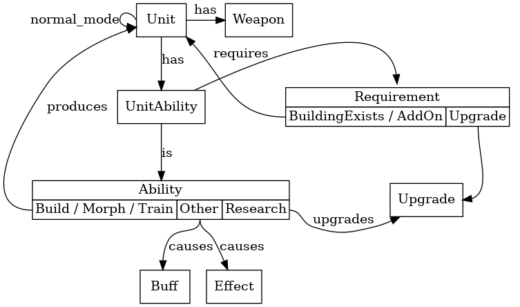

# StarCraft II tech tree and dependencies

All SC2 structures, units, abilities, researches and dependencies between these, in machine readable JSON format and with nice graphs.
Also a Rust libarary for querying the data.

This repository contains Python scripts for data generation, and
a Rust library for data validation, queries and overall usage.

## "I want to look at the cool graphs!"

See [visuals page](./docs/Visuals.md), or [the image files](./docs/images).

## "I want to use this with my bot!"

If using Rust, this repostory contains a nice library to query the data.

If not, you can still grab the [raw json data](./data/data.json), which
contains all raw information. Unfortunately, you need to query the data
manually. Unless you find or create a library that does it for you.

# Development

You need `cargo`, `python3.7` or newer + `pipenv`, `jq` and `graphviz` (`dot` command).

The Python code to generate new data is under `generate`, and
the Rust library is naturally under `src`.

See `Makefile` for usage, particularly `make run` and `make update`.

See [schema plan file](./docs/SchemaPlan.txt) for the idealistic schema.

# Missing data? Invalid data? Other issues?

Please [open a new issue in GitHub](https://github.com/Dentosal/sc2-techtree/issues/new).

Pull requests to fix things or for extensions are welcome as well,
although I suggest asking me first by opening an issue or otherwise.
The data model changes are usually quite hard to get right, and the
data collection script itself is quite complicated and full of edge
cases.
